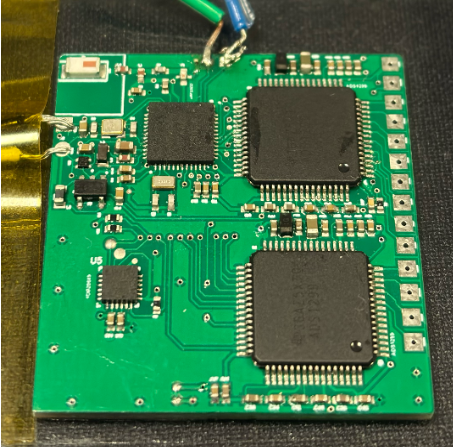

# 12-Lead 10-Electrode ECG v1

BLE firmware for a research-grade ECG wearable prototype built around ADS1299 biopotential acquisition and ICM20649 motion sensing.

## Snapshot

| Category | Details |
| --- | --- |
| Signal focus | 12-lead / 10-electrode ECG development with synchronized motion context |
| MCU platform | Nordic nRF52, nRF5 SDK 17.1.0, S132 BLE stack |
| Sensors | ADS1299 analog front end, ICM20649 IMU |
| Interfaces | SPI for ECG, TWI/I2C for IMU, custom BLE GATT services |
| Main entry | `main.c` |

## What This Project Shows

- Built interrupt-driven ADS1299 acquisition using DRDY timing rather than polling.
- Streamed high-volume ECG samples through a custom BLE service with framed notification payloads.
- Added IMU telemetry for movement correlation and artifact analysis.
- Implemented sample-rate diagnostics using app timer ticks and a DRDY exponential moving average.
- Integrated battery measurement plumbing through SAADC and BLE Battery Service support.
- Preserved multi-toolchain embedded project assets for GCC, IAR, Keil, and SEGGER Embedded Studio.

## Project Media

<div align="center">
  
  <br>
  <sub><b>PCB design.</b> Version 1 nRF52 + dual ADS1299 + ICM20649 ECG board showing component placement and routed layout.</sub>
  <br><br>
  
  <br>
  <sub><b>Assembled prototype.</b> ECG PCB used for firmware bring-up and BLE streaming validation.</sub>
  <br><br>
  
  <br>
  <sub><b>Visualization.</b> Live multi-channel ECG GUI output from the wearable ECG data stream.</sub>
  <br><br>
  
  <br>
  <sub><b>System architecture.</b> BLE architecture connecting the nRF52 controller, dual ADS1299 front ends, and ICM20649 motion sensor.</sub>
</div>

[Project poster](Poster_ECG_Wearable.pdf) - Poster summary for the wearable ECG system and design rationale.

## Firmware Architecture

The firmware initializes the Nordic BLE stack, GPIO/GPIOTE, SPI, TWI, custom services, and application timers. ADS1299 DRDY interrupts drive ECG sample reads, while an application timer services the ICM20649 motion path. Samples are batched into BLE-sized buffers and transmitted only when the central device is connected.

```text
ADS1299 DRDY -> SPI read -> ECG packet buffer -> ble_eeg notification
ICM20649 timer -> TWI read -> IMU packet buffer -> ble_icm notification
SAADC timer -> battery sample -> BLE Battery Service
```

## Key Modules

| Module | Role |
| --- | --- |
| `src/ads1299-x.c` | ADS1299 register setup, SPI transactions, ECG sample acquisition |
| `src/ble_eeg.c` | Custom ECG BLE service and notification path |
| `src/icm20649.c` | ICM20649 register configuration and raw accel/gyro/temp reads |
| `src/ble_icm.c` | IMU BLE packet buffering and transmission |
| `src/nrf_usr_defined.c` | Nordic platform setup and board-level support |
| `src/timing_utils.c` | Timing helpers used for diagnostics and acquisition validation |

## Engineering Depth

This project exercises the core constraints of wearable biomedical firmware: deterministic acquisition, BLE throughput limits, battery-aware scheduling, and sensor synchronization. The code reflects practical embedded decisions such as interrupt-driven ECG reads, BLE packet batching, connection-state checks before sensor work, and a separate low-rate battery measurement path.

## Power And Throughput Considerations

- ECG acquisition is event-driven from ADS1299 DRDY, reducing unnecessary active waiting.
- IMU reads are timer scheduled and buffered before BLE transmission.
- BLE notifications are sent in packed payloads rather than one sample at a time.
- Battery measurement is periodic and routed through a load-control path.
- Diagnostics track effective sample rate so acquisition settings can be tuned against BLE throughput.
