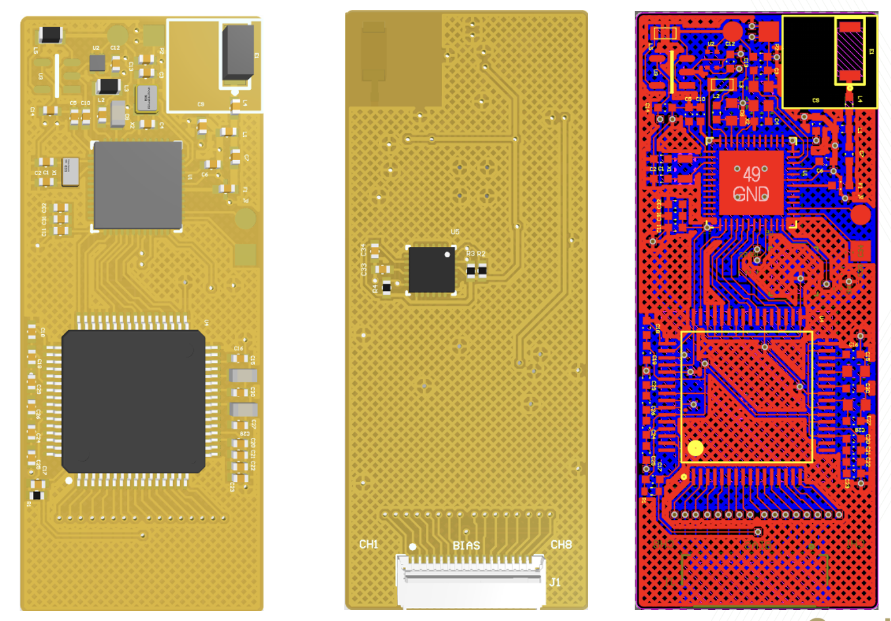

# EMG + ICM40609 Robotic Hand Control

Updated robotic-hand control firmware using ADS1299 biopotential acquisition with an ICM40609 motion sensor driver.

## Snapshot

| Category | Details |
| --- | --- |
| Signal focus | EMG/control signals plus IMU motion |
| MCU platform | Nordic nRF52, nRF5 SDK 17.1.0 |
| Sensors | ADS1299, ICM40609 |
| Interfaces | SPI, TWI/I2C, custom BLE GATT |
| Main entry | `main.c` |

## What This Project Shows

- Migrated the motion subsystem to ICM40609 while retaining the ADS1299 signal-acquisition path.
- Implemented an ICM40609 driver with register-level configuration and raw sample reads.
- Packaged EMG and IMU samples into BLE notifications suitable for a live control or GUI pipeline.
- Preserved sample-rate instrumentation for validating real streaming performance.

## Project Media

<div align="center">
  
  <br>
  <sub><b>PCB design.</b> EMG + ICM40609 robotic-hand control board showing component placement, board back side, and routed layout.</sub>
</div>

## Firmware Architecture

```text
ADS1299 DRDY interrupt -> SPI sample read -> BLE biopotential packet
ICM40609 app timer -> TWI sample read -> BLE IMU packet
nRF52 SoftDevice -> custom services -> central application / controller
```

## Key Modules

| Module | Role |
| --- | --- |
| `src/ads1299-x.c` | ADS1299 acquisition and SPI driver logic |
| `src/icm40609.c` | ICM40609 driver and motion sampling path |
| `src/ble_eeg.c` | Biopotential BLE service |
| `src/ble_icm.c` | IMU BLE service |
| `pca10040/s132/config/icm40609.h` | ICM40609 register definitions and sample layout |
| `pca10040/s132/config/icm40609_config_5ms.h` | IMU sampling configuration |

## Engineering Depth

This project is a good example of hardware migration work: the application goal stays the same, but the sensor driver, register map, sampling profile, and validation path change. That kind of work requires careful separation between acquisition logic, driver internals, BLE payload layout, and board configuration.

## Power And System Design

- Uses scheduled IMU reads instead of continuous foreground polling.
- Keeps BLE streaming connection-aware.
- Batches samples for notification efficiency.
- Separates high-rate acquisition from platform services such as battery and device information.
