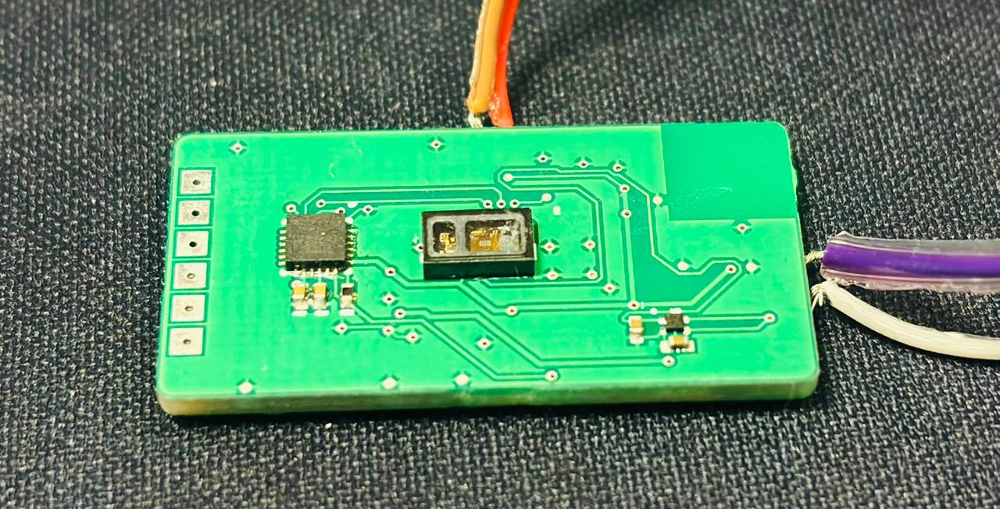

# Sleep Prediction Multimodal Wearable Firmware

BLE firmware for a sleep-monitoring prototype combining biopotential, motion, and optical sensing streams.

## Snapshot

| Category | Details |
| --- | --- |
| Signal focus | Sleep prediction and sleep-state research |
| MCU platform | Nordic nRF52, nRF5 SDK 17.1.0 |
| Sensors | ADS1299, ICM20649, MAX30102 |
| Signals | ECG/biopotential, motion, PPG/SpO2-oriented optical data |
| Main entry | `main.c` |

## What This Project Shows

- Built a multimodal wearable firmware stack with electrical, inertial, and optical sensors.
- Integrated MAX30102 optical acquisition alongside existing ADS1299 and ICM20649 paths.
- Added BLE services for biopotential, IMU, and SpO2/PPG-style optical payloads.
- Kept per-sensor diagnostics for sample-rate and interrupt/read timing.
- Structured the system so each sensing path can be tuned independently.

## Project Media

<div align="center">
  
  <br>
  <sub><b>Assembled hardware.</b> Sleep-prediction wearable PCB showing the nRF52 controller and sensing hardware.</sub>
  <br><br>
  
  <br>
  <sub><b>Optical sensor board.</b> MAX30102 sensing area and wiring on the sleep-prediction prototype.</sub>
  <br><br>
  
  <br>
  <sub><b>PCB render.</b> Board render for the multimodal sleep-prediction wearable.</sub>
  <br><br>
  
  <br>
  <sub><b>PCB routed layout.</b> Routed layout for the sleep-prediction wearable board.</sub>
</div>

[PPG live view demo](../PPG%20Live%20View%20%28MAX30102%29%20_%20Freq_%20100.0%20Hz_ch%202026-05-04%2015-26-00.mp4) - MAX30102 PPG live-view GUI demo at 100 Hz, showing optical waveform streaming over BLE.

## Firmware Architecture

```text
ADS1299 DRDY -> ECG/biopotential BLE stream
ICM20649 timer -> motion BLE stream
MAX30102 interrupt/read path -> optical BLE stream
Battery/Device services -> wearable status metadata
```

The application uses the nRF52 SoftDevice BLE stack with custom services for the high-rate streams and standard service support where useful.

## Key Modules

| Module | Role |
| --- | --- |
| `src/ads1299-x.c` | ADS1299 biopotential acquisition |
| `src/icm20649.c` | Motion sensor driver |
| `src/max30102.c` | MAX30102 optical sensor driver |
| `src/ble_eeg.c` | Biopotential BLE transport |
| `src/ble_icm.c` | IMU BLE transport |
| `src/ble_spo.c` | Optical / SpO2-oriented BLE transport |

## Engineering Depth

Sleep wearables are constrained by simultaneous sensing, battery life, BLE bandwidth, and comfort-driven form factor. This project demonstrates how those constraints were handled in firmware: sensor-specific drivers, independent timing paths, connection-aware transmission, packed notifications, and debug counters for validating real acquisition behavior.

## Power And Data Strategy

- Each sensor path has separate scheduling and buffering.
- BLE notifications are packed to reduce radio overhead.
- MAX30102 diagnostics track interrupt and read rates for validating optical sampling.
- Battery service support can be used to correlate current draw with active sensing modes.
